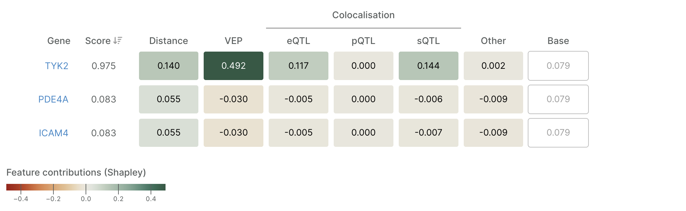

# 🆕 Credible Set

## Overview

A **credible set** is a set of genetic variants near a genetic association signal that is predicted, with a specific probability, to include the causal variant for that signal. The results of the fine-mapping analysis determine this, assigning each variant in the region a posterior probability of being causal when considering the observed statistics and the population structure. The variants covering the top 95% likelihood of containing the causal variant define the credible sets in the Platform.

A credible set results from statistical analysis on a specific locus in a study. As a consequence, all credible sets are defined as:

* **Study** in which the association is reported
* **Lead variant -** Variant with the highest posterior probability in the credible set
* **Fine-mapping** method and statistics

The Platform contains every credible set resulting from [fine-mapping](gentropy/fine-mapping.md) all our [sources](gentropy/data-sources.md) after applying certain [exclusion criteria](credible-set.md#credible-set-exclusion-criteria).


**Credible set identifier**

Different from other entities in the Open Targets Platform, credible sets are identified with an alphanumeric list of characters that have no semantic meaning. The identifier is derived from a combination of fields that define a credible set's uniqueness, and it will remain the same as long as the credible set metadata hasn't changed.&#x20;


## Credible set exclusion criteria

Credible sets fulfilling any of the next rules are excluded from the Platform:

1. The lead variant is within the MHC region (chr6:25726063-33400556)
2. The credible set is not in a [valid study](study.md#inclusion-criteria)
3. There is another fine-mapped SuSiE credible set from the same region and study
4. Being a GWAS catalog fine-mapped top-hit, there is a GWAS catalog fine-mapped credible set from summary statistics for the same region and study
5. The lead variant is reported in an invalid chromosome (1:22, X, Y, XY, MT)
6. The sum of PIPs in the credible is not within the \[0.95,1] range

## Credible set confidence

Credible sets are categorised based on the fine-mapping confidence, derived from the available association data, [fine-mapping](gentropy/fine-mapping.md) framework and availability of linkage disequilibrium (LD) information for the specific study/population . The categories in descending order of confidence are:&#x20;

* SuSiE or SuSiE-inf fine-mapped credible set with in-sample LD
* SuSiE or SuSiE-inf fine-mapped credible set with out-of-sample LD
* PICS fine-mapped credible set extracted from summary statistics
* PICS fine-mapped credible set based on reported curated association
* Unknown confidence

The confidence values are symbolised by 0 to 4 stars on the UI. It is important to note that this confidence does not reflect the strength of the association or the effect size.

## Credible set variants

All variants in the credible set are annotated with:

* **P-value**. Unconditioned p-value from the study when available.
* **Beta**. Corresponds to SuSiE _mu_ (SuSiE fine-mapped GWAS Catalog, UKBB-PPP and FinnGen) or beta (PICS fine-mapped GWAS Catalog and SuSiE fine-mapped eQTL Catalog)&#x20;
* **Standard error**. Only available for PICS-fine-mapped credible sets.
* **LD (r^2)**. Linkage-disequilibrium information. Only available for PICS-fine-mapped credible sets.
* **Posterior probability.** Posterior inclusion probability (PIP) of variant being causal after fine-mapping.
* **log(BF)**. The logarithm of the Bayes factor. Only available for SuSiE credible sets.
* **Predicted consequence**. The most severe consequence is across all overlapping canonical transcripts, as reported by the Ensembl VEP.

## Locus-to-Gene (L2G)

Machine-learning prioritisation of likely causal genes based on available features. L2G integrates multiple features to predict what's the most likely causal gene in the neighbourhood of the observed association. All predictions for protein-coding genes with a score above 0.05 are displayed. See [Locus-to-Gene](gentropy/locus-to-gene-l2g.md) section for a description of the methodology.

### Explaining L2G predictions

Using the [SHAP](https://shap.readthedocs.io/en/latest/example_notebooks/overviews/An%20introduction%20to%20explainable%20AI%20with%20Shapley%20values.html) (SHapley Additive exPlanations) library, we have extracted feature importance values for all L2G predictions. Shapley values provide a principled approach based on game theory to explain the contribution of individual features or groups of features, revealing how each group influences the final L2G score. These contributions are approximated to be additive, meaning the sum of the Shapley values for all feature groups equals the total L2G score or reasonably close to it.

<figure><figcaption>
L2G prioritisation for a <a href="https://platform.opentargets.org/credible-set/b8a67437f19eb1607f9219ea17adebe7">credible set linking to psoriasis</a>.
</figcaption></figure>

We have aggregated the Shapley values into the main feature groups to understand their relative importance.

> The **base value** represents the baseline before any feature-specific information is considered, and is therefore equivalent for all genes and credible sets.

This approach helps to identify which types of evidence (e.g. distance, colocalisation or functional impact) are most influential for a given locus-gene association. In addition, we can visualise the individual contribution of each feature within the group. As the features within the group are highly correlated, the individual values are less interpretable than the group contribution.


**Additivity of SHAP values**

Because the SHAP analysis is an approximation, in some occasions, the sum of all shapley values might not result in the L2G score.


A full description of all features is available here.

**Source**: [Open Targets](gentropy/locus-to-gene-l2g.md)

## Colocalisation

Credible sets are compared against other credible sets to find overlapping signals. Two overlapping credible sets are those that share at least one variant in the set. The Platform contains all the overlaps between all GWAS vs all GWAS and all GWAS vs all molQTL studies.

For the overlapping pairs of credible sets, estimates for two co-localisation methods are computed based on the type of credible set:

* [COLOC](gentropy/colocalisation.md#coloc-colocalisation) - for overlapping SuSiE fine-mapped credible sets
* [eCAVIAR](gentropy/colocalisation.md#ecaviar-colocalisation) - for all overlapping credible sets&#x20;

Source: [Open Targets](gentropy/colocalisation.md)

### Colocalisation directionality&#x20;

A directionality assessment is included in the colocalisation analysis to help the user interpret the relationship between the two overlapping credible sets.

For every overlapping variant in a pair of overlapping credible sets, the sign of the ratio between both [beta](credible-set.md#credible-set-variants) estimates are calculated (+1 or -1) indicating the individual variant directionality. The average of these signs across all overlapping variants in both credible sets is used to estimate the sign estimates. When the average approximates to +1, the two credible sets are assessed to share the **same** directionality. If the average approximates to -1, the two credible sets are interpreted to have **opposite** directionality. In any other case, the assessment is declared inconclusive (N/A).

Source: [Open Targets](gentropy/colocalisation.md)

