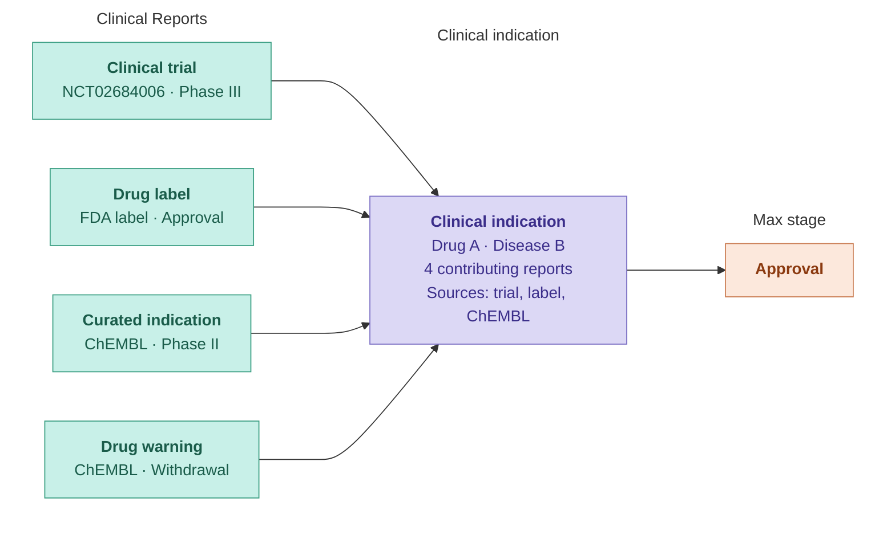

# 🆕 Drugs and Clinical Candidates

The **Drugs and Clinical Candidates** widget provides a disease-centric view of drugs and clinical candidates with evidence for the disease, based on the **Clinical Indications** dataset.&#x20;

A clinical indication consolidates all clinical reports sharing the same drug and disease into a single record, aggregating evidence across sources and development stages while preserving traceability to each contributing report.

For each drug/indication pair, the widget displays the **maximum clinical stage** reached across all contributing reports. This is determined by ranking harmonised clinical stage values from each clinical report, with one explicit rule: if at least one supporting report has a stage of _Phase IV_ or _Withdrawal_, the maximum clinical stage is set to _Approval_, reflecting the assumption that marketing authorisation must have been reached before a post-marketing or withdrawal context can occur.


For a full description of the **clinical stage categories** and their ranking, see [Clinical stage categories](../drug/clinical-report.md#clinical-stage-categories) in the Clinical Report page.


