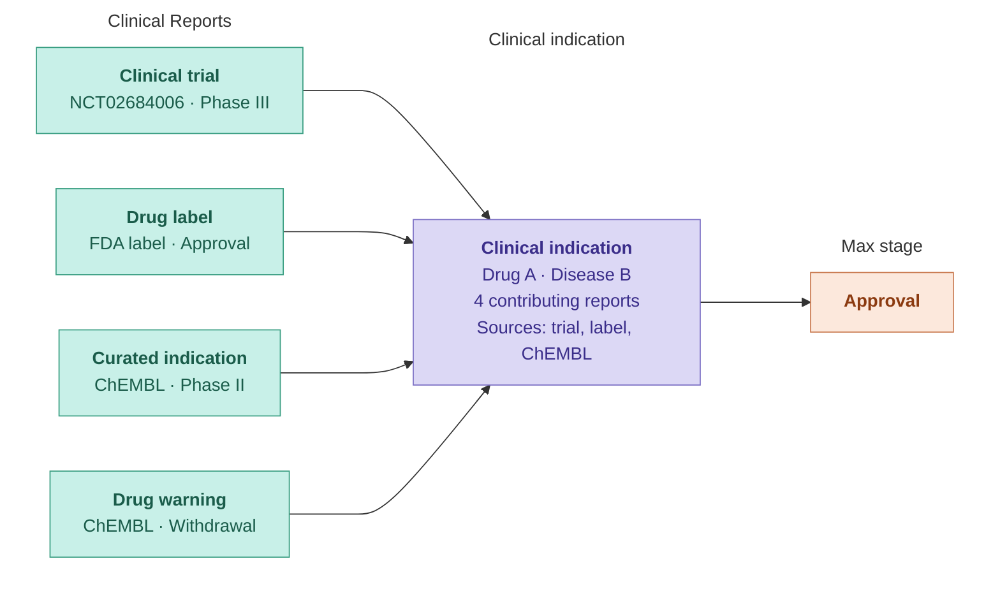

# 🆕 Indications

The **Indications** widget provides a drug-centric view of the same Clinical Indications dataset described in the [Drugs and Clinical Candidates](../disease-or-phenotype/drugs.md) section of the Drug page. In this case, the drug is fixed, and the widget displays all diseases for which it has clinical evidence, aggregated across sources and [development stages](clinical-report.md#clinical-stage-categories).

The same aggregation logic applies: clinical reports sharing the same drug and disease are consolidated into a single record, and the maximum clinical stage is assigned using the same ranking rules.


For a full description of the **clinical stage categories** and their ranking, see [Clinical stage categories](clinical-report.md#clinical-stage-categories) in the Clinical Report page.


