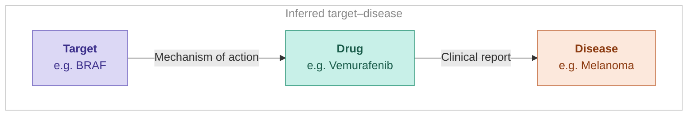

# 🆕 Drugs and Clinical Candidates

The **Drugs and Clinical Candidates** widget on the Target page is based on the **Clinical Target** dataset. Unlike the [Disease page equivalent](../disease-or-phenotype/drugs.md), which fixes a disease and lists drugs, this view fixes a target and surfaces the diseases for which connected drugs have clinical evidence.

The dataset is built by joining two sources: clinical reports, which link drugs to diseases, and drug mechanism of action data, which links drugs to targets. Each row in the widget represents a drug linked to both the selected target and disease. The **maximum stage** shown is the highest clinical development stage that the drug has reached across all its supporting indications.


For a full description of the **clinical stage categories** and their ranking, see [Clinical stage categories](../drug/clinical-report.md#clinical-stage-categories) in the Clinical Report page.

